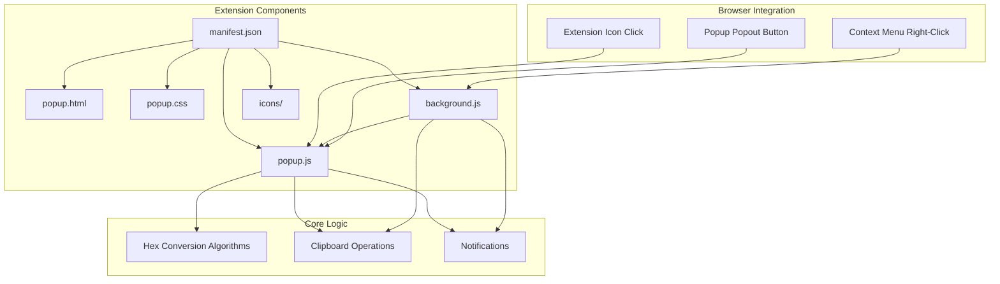
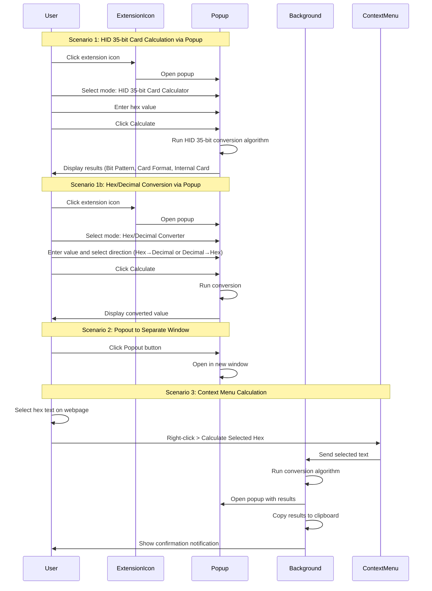

# MS Edge Browser Extension: Brivo Card Calculator

## Overview
Convert the Brivo Access Control Card Calculator web tool into a Microsoft Edge browser extension with popup, popout, and context menu functionality.

## Extension Features

### 1. Popup Interface
- Opens when clicking the extension icon in the browser toolbar
- Full calculator UI with bit length dropdown and hex input
- Calculate and Reset buttons
- Results display: Bit Pattern, Card Format, Internal Card #, Facility Code
- Popout button to open in separate window

### 2. Context Menu Integration
- Right-click context menu option: "Calculate Selected Hex"
- When triggered:
  - Opens popup with pre-populated calculation results

### 3. Supported Card Formats
- HID Corporate 1000 35 Bit (primary focus)

### 4. Additional Conversion Features
- Hex to Decimal conversion
- Decimal to Hex conversion

## Architecture



## User Flow



## File Structure

```
badge_id_extension/
├── manifest.json          # Extension manifest (V3)
├── popup.html            # Popup UI structure
├── popup.css             # Popup styling
├── popup.js              # Popup logic & hex conversion
├── background.js         # Service worker for context menu
├── icons/
│   ├── icon-16.png       # 16x16 icon
│   ├── icon-48.png       # 48x48 icon
│   └── icon-128.png      # 128x128 icon
└── README.md             # Installation & usage docs
```

## Technical Specifications

### manifest.json
- Manifest Version: 3
- Permissions: `contextMenus`, `clipboardWrite`, `notifications`
- Action: Popup (`popup.html`)
- Background: Service worker (`background.js`)
- Icons: 16, 48, 128 pixels

### Hex Conversion Algorithms

The conversion algorithms parse hexadecimal values and extract card information:

| Bit Length | Format | Description |
|------------|--------|-------------|
| 35 | HID Corporate 1000 | HID proprietary format with facility code and card number |

#### HID Corporate 1000 35-bit Format
- Total bits: 35
- Structure: [Parity][Facility Code (16 bits)][Card Number (16 bits)][Parity]
- Facility Code: Bits 2-17 (16 bits)
- Card Number: Bits 18-33 (16 bits)
- Parity bits: Bit 1 (even parity), Bit 35 (odd parity)

### Popup UI Components
- **Input Section**
  - Mode selector: HID 35-bit Card Calculator OR Hex/Decimal Converter
  - For HID 35-bit: Hex input field
  - For Hex/Decimal: Input field with toggle (Hex ↔ Decimal)
  - Calculate button
  - Reset button
  - Popout button

- **Results Section (HID 35-bit)**
  - Bit Pattern display
  - Card Format display (HID Corporate 1000 35 Bit)
  - Internal Card # display
  - Facility Code display
  - Copy to clipboard button

- **Results Section (Hex/Decimal)**
  - Input value display
  - Converted value display
  - Copy to clipboard button

### Context Menu Flow
1. User selects hex text on any webpage
2. Right-click and select "Calculate Selected Hex (HID 35-bit)"
3. Background service worker:
   - Extracts selected text
   - Runs HID 35-bit conversion algorithm
   - Opens popup with results pre-populated
   - Copies results to clipboard
   - Shows notification: "Results copied to clipboard"

### Hex/Decimal Conversion Flow
1. User opens popup
2. Selects "Hex/Decimal Converter" mode
3. Enters value in input field
4. Selects conversion direction (Hex→Decimal or Decimal→Hex)
5. Clicks Calculate
6. Converted value is displayed
7. Can copy result to clipboard

## Implementation Notes

### Input Validation
- Validate hex format (0-9, A-F, case-insensitive)
- Validate hex length matches selected bit length
- Show error messages for invalid input

### Error Handling
- Invalid hex format
- Hex length mismatch
- Unsupported bit length
- Clipboard access failures

### Styling
- Clean, modern UI matching Brivo brand
- Responsive design
- Dark/light mode support (optional)
- Accessible colors and contrast

### Notifications
- Browser notification API for clipboard confirmation
- Visual feedback in popup for successful operations

## Testing Checklist

- [ ] Popup opens correctly on icon click
- [ ] HID 35-bit mode works correctly
- [ ] Hex/Decimal converter mode works correctly
- [ ] Hex to Decimal conversion produces accurate results
- [ ] Decimal to Hex conversion produces accurate results
- [ ] HID 35-bit card conversion produces accurate results
- [ ] Reset button clears all fields
- [ ] Popout opens in separate window
- [ ] Context menu appears on right-click
- [ ] Context menu calculates selected hex correctly
- [ ] Results copied to clipboard
- [ ] Notification appears after context menu calculation
- [ ] Error handling works for invalid input
- [ ] Extension loads without errors in Edge
- [ ] Icons display correctly

## Installation Instructions

1. Open Microsoft Edge browser
2. Navigate to `edge://extensions/`
3. Enable "Developer mode" toggle
4. Click "Load unpacked"
5. Select the `badge_id_extension` directory
6. Extension is now installed

## Usage Instructions

### Using Popup - HID 35-bit Card Calculator
1. Click the extension icon in the toolbar
2. Select mode: "HID 35-bit Card Calculator"
3. Enter the hex value
4. Click "Calculate" to see results
5. View: Bit Pattern, Card Format, Internal Card #, Facility Code
6. Click "Popout" to open in separate window (optional)
7. Click "Reset" to clear and start over

### Using Popup - Hex/Decimal Converter
1. Click the extension icon in the toolbar
2. Select mode: "Hex/Decimal Converter"
3. Enter value in input field
4. Select conversion direction: "Hex → Decimal" or "Decimal → Hex"
5. Click "Calculate" to see converted value
6. Click "Copy" to copy result to clipboard

### Using Context Menu
1. Highlight/select a hex value on any webpage
2. Right-click the selected text
3. Select "Calculate Selected Hex (HID 35-bit)"
4. Popup opens with results
5. Results are automatically copied to clipboard
6. Confirmation notification appears

## Future Enhancements (Optional)

- Add support for additional card formats (26, 33, 34, 37, 40 bit)
- History of recent calculations
- Export results to CSV/JSON
- Keyboard shortcuts
- Dark mode toggle
- Batch calculation for multiple hex values
- Auto-detect input format (hex vs decimal)
